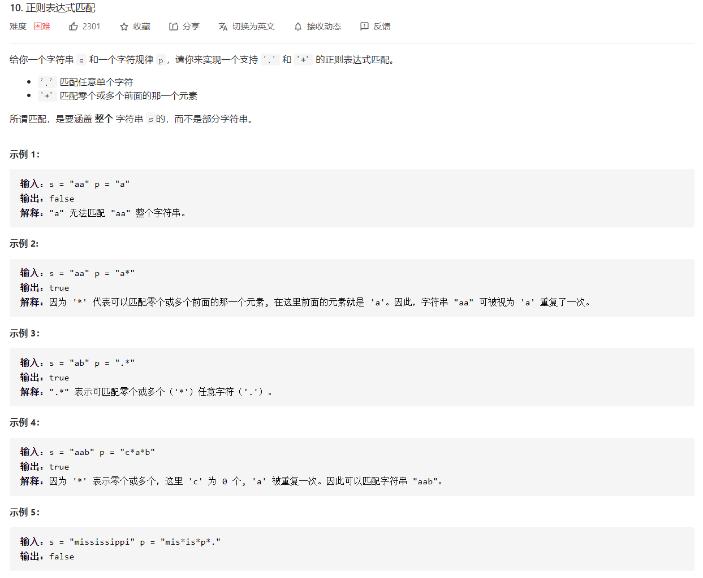

# LEETCODE HOT 100 刷题笔记
---
## [1. 两数之和](https://leetcode-cn.com/problems/two-sum/)


### 方法一：暴力枚举

#### 思路及算法
最容易想到的方法是枚举数组中的每一个数 $x$，寻找数组中是否存在 $target - x$。

当我们使用遍历整个数组的方式寻找 $target - x$ 时，需要注意到每一个位于 $x$ 之前的元素都已经和 $x$ 匹配过，因此不需要再进行匹配。而每一个元素不能被使用两次，所以我们只需要在 $x$ 后面的元素中寻找 $target - x$。

#### 代码

```javascript
var twoSum = function (nums, target) {
    let items = [];
    for(let i=0;i<nums.length;i++) {
        for(let j=i+1;j<nums.length;j++) {
            if(nums[i]+nums[j]==target) {
                items.push(i);
                items.push(j);
                return items;
            }
        }
    }
};
```

#### 复杂度分析

+ 时间复杂度：$O(N^2)$，两个for循环，易得。
+ 空间复杂度：$O(1)$。

### 方法二：

#### 思路及算法
注意到方法一的时间复杂度较高的原因是寻找 $target - x$ 的时间复杂度过高。因此，我们需要一种更优秀的方法，能够快速寻找数组中是否存在目标元素。如果存在，我们需要找出它的索引。

使用哈希表，可以将寻找 $target - x$ 的时间复杂度降低到从 $O(N)$ 降低到 $O(1)$。

这样我们创建一个哈希表，对于每一个 $x$，我们首先查询哈希表中是否存在 $target - x$，然后将 $x$ 插入到哈希表中，即可保证不会让 $x$ 和自己匹配。

#### 代码

```javascript
var twoSum = function (nums, target) {
  let hash = {};
  for (let i = 0; i < nums.length; i++) {
    if (hash[target - nums[i]] !== undefined) {
      return [i, hash[target - nums[i]]];
    }
    hash[nums[i]] = i;
  }
  return [];
};
```

#### 复杂度分析

+ 时间复杂度：$O(N)$。
+ 空间复杂度：$O(N)$，主要用于哈希表的开销。
---
## [2. 两数相加](https://leetcode-cn.com/problems/add-two-numbers/)


### 方法一：模拟

#### 思路及算法
由于输入的两个链表都是逆序存储数字的位数的，因此两个链表中同一位置的数字可以直接相加。

我们同时遍历两个链表，逐位计算它们的和，并与当前位置的进位值相加。具体而言，如果当前两个链表处相应位置的数字为 $n1,n2$，进位值为 $\textit{carry}$，则它们的和为 $n1+n2+\textit{carry}$；其中，答案链表处相应位置的数字为 $(n1+n2+\textit{carry}) \bmod 10$，而新的进位值为 $\lfloor\frac{n1+n2+\textit{carry}}{10}\rfloor$。

如果两个链表的长度不同，则可以认为长度短的链表的后面有若干个 0 。

此外，如果链表遍历结束后，有 $\textit{carry} > 0$，还需要在答案链表的后面附加一个节点，节点的值为 $\textit{carry}$。

#### 代码

```javascript
var addTwoNumbers = function(l1, l2) {
    let dummy = new ListNode();
    let curr = dummy;
    let carry = 0;
    while(l1||l2){
        let sum = 0;
        if(l1){
            sum += l1.val;
            l1 = l1.next;
        }
        if(l2){
            sum += l2.val;
            l2 = l2.next;
        }
        sum += carry;
        curr.next = new ListNode(sum % 10);
        carry = Math.floor(sum/10);
        curr = curr.next;
    }
    if(carry>0){
        curr.next = new ListNode(carry);
        curr = curr.next;
    }
    return dummy.next;
};
```

#### 复杂度分析

+ 时间复杂度：$ O(max(m,n)) $。
+ 空间复杂度：$ O(1) $。

#### 小注

考虑过先把两个数组转换成数字然后相加，把相加的结果转换成字符串并且转换成数组；这样的方法的不可行之处在于字符串和整型的 maxsize 不同，如果当数字过大的时候，字符串是没法正常表示的；

---

## [3. 无重复字符的最长子串](https://leetcode-cn.com/problems/longest-substring-without-repeating-characters/)


### 方法一：暴力枚举

#### 思路及算法
最快想到的就是暴力遍历，以每个字符串为开头遍历一遍
也就是总共要遍历两遍

#### 代码

```javascript
function lengthOfLongestSubstring(s) {
  let len = s.length;
  let result = 0;

  for (let i = 0; i < len; i++) {
    let set = new Set();
    let maxLen = 0;
    let j = i;
    while (j < len && !set.has(s[j])) {
      set.add(s[j]);
      maxLen++;
      j++;
    }
    result = Math.max(result, maxLen);
  }
  return result;
}
```

#### 复杂度分析

+ 时间复杂度：$ O(N^2) $。
+ 空间复杂度：$ O(m) $。

### 方法二：滑动窗口

#### 思路及算法
1、用双指针维护一个滑动窗口，用来剪切子串。
2、不断移动右指针，直到遇到重复字符的时候把左指针移到前面的重复字符的下一位。（相当于把前面的重复字符删除）
3、移动指针过程中，记录窗口长度的最大值即为答案。

#### 代码

```javascript
var lengthOfLongestSubstring = function(s) {
  let left = 0;
  let result = 0;
  let map = new Map();
  for(let right=0; right<s.length; right++) {
    if(map.has(s[right]) && map.get(s[right])>=left) {
      left = map.get(s[right]) + 1;
    }
    result = Math.max(result,right-left+1)
    map.set(s[right],right)
  }
  return result;
};
```

#### 复杂度分析

+ 时间复杂度：$ O(N) $。
+ 空间复杂度：$ O(m) $，m的大小为map字符集的大小。

#### 小注

考虑使用哈希表记录每个字符出现的次数,遍历所有可能出现的字符串片段,筛选出所有含有不重复字符的字符串,并记录下最大长度;这个解决方法所存在的问题在于时间复杂度过高,超出了时间限制.

---

## [4. 寻找两个正序数组的中位数](https://leetcode-cn.com/problems/median-of-two-sorted-arrays/)


### 方法一：合并查找

#### 思路及算法
使用归并的方式，合并两个有序数组，得到一个大的有序数组。大的有序数组的中间位置的元素，即为中位数。

#### 代码

```javascript
var findMedianSortedArrays = function(nums1, nums2) {
    let len1 = nums1.length,len2 = nums2.length;
    let len = len1 + len2;
    let index = parseInt(len/2);

    let list = []
    let i=0,j=0;
    while(i<len1&&j<len2) {
        list.push(nums1[i]<=nums2[j]?nums1[i++]:nums2[j++])
    }
    if(j<len2) {
        i=j,len1=len2,nums1=nums2
    }
    for(i;i<len1;i++) {
        list.push(nums1[i])
    }
    if(len%2==0) {
        return (list[index-1]+list[index])/2
    } else {
        return list[index]
    }
};
```

#### 复杂度分析

+ 时间复杂度：$ O(M+N) $。
+ 空间复杂度：$ O(M+N) $。

### 方法二：双指针

#### 思路及算法
因为两个数组有序，求中位数不需要把两个数组合并
当合并后的数组总长度len为奇数时，只要知道索引为len/2位置上的数就行了，如果数偶数，只要知道索引为len/2 - 1和len/2上的数就行，所以不管是奇数还是偶数只要遍历len/2次即可，用两个值来存遍历过程中len/2-1和len/2上的数即可
两个指针point1和point2分别指向nums1和nums2，当nums1[point1] < nums2[point2]，则point1指针移动，否则point2指针移动

#### 代码

```javascript
var findMedianSortedArrays = function(nums1, nums2) {
  let len1 = nums1.length,len2 = nums2.length;
  let len = len1 + len2;

  let preValue = -1,curValue = -1;
  let point1 = 0, point2 = 0;
  for (let i = 0; i <= Math.floor(len/2); i++) {
    preValue = curValue;
    if (point1 < len1 && (point2 >= len2 || nums1[point1] < nums2[point2])) {
      curValue = nums1[point1];
      point1++;
    } else {
      curValue = nums2[point2];
      point2++;
    }
  }
  return len % 2 === 0 ? (preValue + curValue) / 2 : curValue
};
```

#### 复杂度分析

+ 时间复杂度：$ O(M+N) $。
+ 空间复杂度：$ O(1) $。

---

## [5. 最长回文子串](https://leetcode-cn.com/problems/longest-palindromic-substring/)


### 方法一：双执政

#### 思路及算法
使用两个指针分别指向目标字符串的第一个字符head和最后一个字符tail，head确定之后tail不停往后移，并不断判断是否符合回文，若符合且长度大于result则覆盖；tail到了最后一个字符之后，head后移，继续如上过程；直到head也指向最后一个字符；

改良思路一：由于一直记录回文的最大长度，所以在head后移的过程中可以判断head到末尾的长度，如果这个长度小于最大长度，那么就可以结束了，因为就算此时的head到末尾的这个字符串符合回文，它的长度也会比最大长度小；

改良思路二：使用KMP算法，使head有可能不会一个一个往后移，从而优化时间复杂度；

#### 代码

```javascript
 var checkStr = (s) => {
  let len = s.length;
  let left=0,right=len-1;
  if(len==2&&s[0]!=s[1]) {
    return false;
  }
  while(left!=right&&left-1!=right) {
    if(s[left]==s[right]) {
      left++;right--;
    } else {
      return false
    }
  }
  return true
}

var longestPalindrome = (s) => {
  let maxStr = '';
  for(let i=0;i<s.length;i++) {
    for(let j=i+1;j<s.length+1;j++) {
      let str = s.slice(i,j);
      if(checkStr(str)==true && str.length>=maxStr.length) {
        maxStr = str;
      }
    }  
  }
  return maxStr
}
```

#### 复杂度分析

+ 时间复杂度：$ O(N^2) $。
+ 空间复杂度：$ O(1) $。

### 方法二：中心扩散

#### 思路及算法
如果是一个回文字符串，说明其有一个对称轴，从这个对称轴往两侧延伸，如果一直到边界都符合左右指针指向字符都相同的情况，则证明此字符串回文。
这样只需要遍历一遍字符串，对每一个字符都进行中心扩散，就可以找到所有回文子串，记录下最大长度的回文子串即可。

#### 代码

```javascript
var longestPalindrome = function(s) {
  let len = s.length;
  if(len<2) {
    return s;
  }
  let left=0,right=0;
  for(let i=0;i<len;i++) {
    check(i,i+1);check(i,i);
  }

  function check(m,n) {
    while(m>=0 && n<len && s[m]==s[n]) {
      m--;n++;
    }
    if(n-m>right-left) {
      left = m; right = n;
    }
  }

  return s.slice(left+1,right)
}
```

#### 复杂度分析

+ 时间复杂度：$ O(N^2) $。
+ 空间复杂度：$ O(1) $。

---

## [10. 正则表达式匹配](https://leetcode-cn.com/problems/regular-expression-matching/)



### 方法一：暴力匹配
首先判断两个字符串的长度，如果第二个字符串不含 * 且长度比第一个字符串小，则直接返回 false 即可。


#### 思路及算法

#### 代码

```javascript
```

#### 复杂度分析

+ 时间复杂度：$ O(N^2) $。
+ 空间复杂度：$ O(N^2) $。

### 方法二：

#### 思路及算法

#### 代码

```javascript
```

#### 复杂度分析

+ 时间复杂度：$ O(N^2) $。
+ 空间复杂度：$ O(N^2) $。

---

## [11. 盛最多水的容器](https://leetcode-cn.com/problems/container-with-most-water/)


### 方法一：暴力

#### 思路及算法
暴力解法也就是遍历所有可能的数字对，以二者中较小值作为高度，二者之间的序列值的差值作为宽度，相乘即可得到区域面积；通过记录最大面积作为返回值

#### 代码

```javascript
var maxArea = function(height) {
    let len = height.length;
    let maxWater = 0;
    for(let i=0; i<len; i++) {
        for(let j=i+1; j<len; j++) {
            maxWater = Math.max(maxWater, Math.min(height[i],height[j]) * (j-i))
        }
    }
    return maxWater
};
```

#### 复杂度分析

+ 时间复杂度：$ O(N^2) $。
+ 空间复杂度：$ O(1) $。

#### 小注
代码可以运行并且无误，但是超出了平台的时间限制 QAQ

### 方法二：双指针法

#### 思路及算法
首先对该问题进行模式识别，由于有左右两个边界，需要移动左右两侧的问题，自然可以考虑使用双指针法。那么接下来所要解决的问题也就是如何去移动两个指针。

题目所给的已知条件我们可以得出，相同情况下（边界的两个高度相同），边界间距越大越好；区域的面积受限于两个边界中的较小值。

解法的主要思路就是：
1. 两个指针分别从两头出发，相向而行
2. 每次只移动高度较小的指针，并比较记录最大面积

#### 代码

```javascript
let len = height.length;
let left = 0, right = len-1;
let maxWater = 0;
while((left-1)!=right) {
    maxWater = Math.max(maxWater, (right-left) * Math.min(height[left], height[right]))
    height[left]<height[right]?left++:right--; 
}
return maxWater
```

#### 复杂度分析

+ 时间复杂度：$ O(N) $。
+ 空间复杂度：$ O(1) $。

--- 

## [15. 三数之和](https://leetcode-cn.com/problems/3sum/)


### 方法一：暴力解法

#### 思路及算法
三数之和，三个 for 循环瞬间解决问题，时间复杂度三次方，这太暴力了 QAQ

又由于题目还要求结果不能重复，所以还需要进行去重操作，太麻烦了，还是别暴力了吧

#### 复杂度分析

+ 时间复杂度：$ O(N^3) $。
+ 空间复杂度：$ O(1) $。

### 方法二：双指针法

#### 思路及算法
题目中的关键字在于 不可以包含重复，所有对问题模式识别之后我们可以选择使用`排序`来避免重复答案

另外，我们可以将三数之和降维为两数之和，这样就巧妙地把问题转换为可以用双指针法解决的问题了。

#### 代码

```javascript
```

#### 复杂度分析

+ 时间复杂度：$ 排序：O(logN)，搜索：O(N^2)，双指针法：O(N^2) --> 总：O(N^2)$。
+ 空间复杂度：$ O(1) $。
